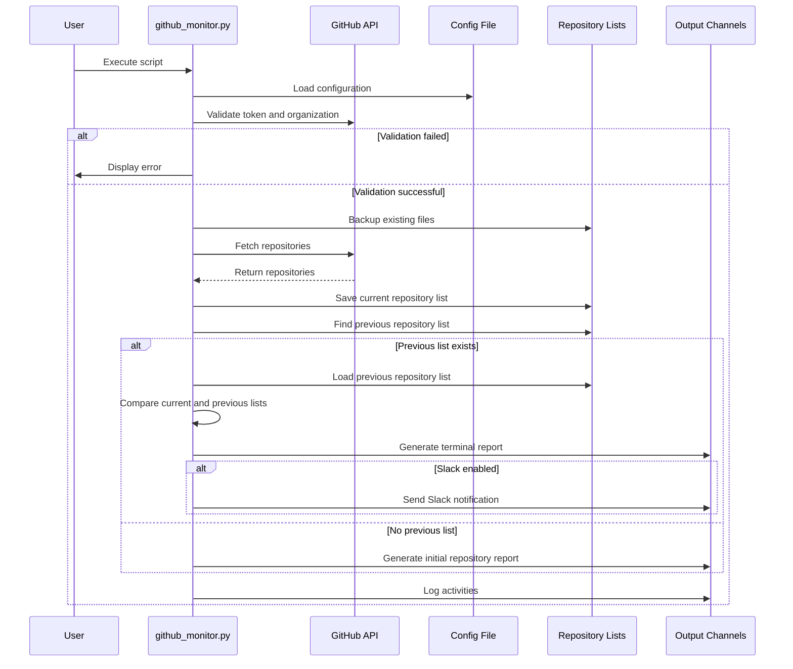

# GitHub Repository Monitor

```
 ██████╗ ██╗████████╗██╗  ██╗██╗   ██╗██████╗     ███╗   ███╗ ██████╗ ███╗   ██╗██╗████████╗ ██████╗ ██████╗ 
██╔════╝ ██║╚══██╔══╝██║  ██║██║   ██║██╔══██╗    ████╗ ████║██╔═══██╗████╗  ██║██║╚══██╔══╝██╔═══██╗██╔══██╗
██║  ███╗██║   ██║   ███████║██║   ██║██████╔╝    ██╔████╔██║██║   ██║██╔██╗ ██║██║   ██║   ██║   ██║██████╔╝
██║   ██║██║   ██║   ██╔══██║██║   ██║██╔══██╗    ██║╚██╔╝██║██║   ██║██║╚██╗██║██║   ██║   ██║   ██║██╔══██╗
╚██████╔╝██║   ██║   ██║  ██║╚██████╔╝██████╔╝    ██║ ╚═╝ ██║╚██████╔╝██║ ╚████║██║   ██║   ╚██████╔╝██║  ██║
 ╚═════╝ ╚═╝   ╚═╝   ╚═╝  ╚═╝ ╚═════╝ ╚═════╝     ╚═╝     ╚═╝ ╚═════╝ ╚═╝  ╚═══╝╚═╝   ╚═╝    ╚═════╝ ╚═╝  ╚═╝
```

A powerful and efficient Python application to monitor changes in GitHub organization repositories with secure token management, beautiful terminal output, and optional Slack notifications.

## 🚀 Features

- 📊 **Efficient Repository Tracking**: Monitors any GitHub organization for repository additions and deletions
- 🔄 **Optimized Performance**: O(n log n) time complexity for repository comparisons
- 🔍 **Automatic Change Detection**: Detects new and deleted repositories between runs
- 🎨 **Beautiful Terminal Output**: Color-coded tables and styled content in the terminal
- 📱 **Slack Integration**: Optional notifications for changes via Slack webhooks
- 📝 **Detailed Logging**: Comprehensive timestamped logs with severity levels
- 🔒 **Error Handling**: Robust error catching and reporting
- 💾 **Automatic Backups**: Keeps history of previous runs with dated backups
- ⚙️ **Customizable**: Command-line options for organization, tokens, and more
- 🔐 **Secure Token Storage**: Securely stores GitHub tokens and credentials
- 🔁 **Automatic Retries**: Handles network issues with automatic retries
- ✅ **Token & Organization Validation**: Validates tokens and organizations before running
- 📋 **Configuration Management**: Dedicated utility for managing configurations
- 🏠 **User-specific Config**: Stores settings in user's home config directory

## 📋 Requirements

- Python 3.6+
- Required Python packages (specified in requirements.txt):
  - requests
  - colorama
  - rich
  - configparser

## 🔧 Installation

1. Clone this repository or download the Python scripts
2. Install required Python packages:

```bash
pip install -r requirements.txt
```

3. Set up your configuration (GitHub token and organization):

```bash
python setup_config.py
```

4. Make the script executable (optional):

```bash
chmod +x github_monitor.py
```

## 📚 Usage

### Configuration

First, set up your configuration using the dedicated configuration utility:

```bash
python setup_config.py
```

This interactive utility will help you securely configure:

- `--org`: GitHub organization name

- `--token`: GitHub API token (validated during setup)

- `--slack`: Slack webhook URL (if needed)

- `--enable_slack`: Slack notification preferences

### Basic Usage

Run the monitor using your stored configuration:

```bash
python github_monitor.py
```

### Advanced Usage

Override stored configuration or use additional options:

```bash
python github_monitor.py [OPTIONS]
```

Available options:

- `--help`: Show help message
- `--org NAME`: Override GitHub organization name
- `--token TOKEN`: Override GitHub API token
- `--slack URL`: Override Slack webhook URL
- `--enable-slack`: Enable Slack notifications using stored webhook URL
- `--show-config`: Display current configuration
- `--dry-run`: Run without making changes (for testing)

### Examples

Show current configuration:

```bash
python github_monitor.py --show-config
```

Monitor a specific organization (overriding stored config):

```bash
python github_monitor.py --org Microsoft
```

Use with a different GitHub token:

```bash
python github_monitor.py --token your_github_token_here
```

Enable Slack notifications with a new webhook URL:

```bash
python github_monitor.py --slack https://hooks.slack.com/services/your/webhook/url
```

Enable Slack notifications using the stored webhook URL:

```bash
python github_monitor.py --enable-slack
```

## 🏗️ Architecture

```
                                 +-----------------------+
                                 |                       |
                                 |   GitHub API          |
                                 |                       |
                                 +-----------------------+
                                           ^   |
                                           |   |
                                           |   | HTTP/HTTPS
                                           |   | Requests
                                           |   v
+------------------------+      +------------------------+
|                        |      |                        |
| Configuration Manager  |<---->| GitHub Repository      |
| (setup_config.py)      |      | Monitor                |
|                        |      | (github_monitor.py)    |
+------------------------+      +------------------------+
        ^   |                         |         ^
        |   |                         |         |
        |   v                         v         |
+------------------------+      +------------------------+
|                        |      |                        |
| User Config Directory  |      | Repository Lists       |
| (~/.config/github-     |<---->| - Current (today.txt)  |
|  monitor/config.ini)   |      | - Previous (hist.txt)  |
|                        |      |                        |
+------------------------+      +------------------------+
                                         |    ^
                                         |    |
                                         v    |
                       +---------------------------------------+
                       |                                       |
                       | Output Channels                       |
                       | - Console (Rich Formatted Output)     |
                       | - Log File (Timestamped, Structured)  |
                       | - Slack (Optional Notifications)      |
                       |                                       |
                       +---------------------------------------+
```

## 📋 Process Flow

```
┌───────────────────────────────────────┐
│ Configuration Management               │
├───────────────────────────────────────┤
│ 1. Load user configuration            │
│ 2. Process command-line arguments     │
│ 3. Validate GitHub token              │
│ 4. Validate organization access       │
└───────────────────────────┬───────────┘
                            ▼
┌───────────────────────────────────────┐
│ Data Collection                       │
├───────────────────────────────────────┤
│ 5. Backup existing files              │
│ 6. Fetch repositories with pagination │
│ 7. Save current repository list       │
└───────────────────────────┬───────────┘
                            ▼
┌───────────────────────────────────────┐
│ Change Detection                      │
├───────────────────────────────────────┤
│ 8. Find previous repository list      │
│ 9. Compare current with previous list │
│10. Identify added & deleted repos     │
└───────────────────────────┬───────────┘
                            ▼
┌───────────────────────────────────────┐
│ Reporting                             │
├───────────────────────────────────────┤
│11. Generate terminal report           │
│12. Send Slack notifications (optional)│
│13. Log all activities                 │
└───────────────────────────────────────┘
```

## 📊 Output Examples

### Configuration Utility

```
GitHub Repository Monitor Configuration

GitHub Token Configuration
✓ Token valid! Authenticated as: Zero0x00
GitHub token updated and validated successfully

GitHub Organization Configuration
✓ Organization 'GooseX' exists and is accessible
Organization 'GooseX' validated and saved

✓ Configuration saved to /home/kali/.config/github-monitor/config.ini

Configuration Summary:
Organization: GooseX
GitHub token: ********5048
Slack webhook: ********************Not set
Slack notifications: Disabled
```

You can also use command-line arguments with the configuration utility:

```bash
python setup_config.py --token YOUR_TOKEN --org GooseX
```

### Main Application Output

```
[2025-05-21 05:51:51] [INFO] GitHub Repository Monitor initialized
[2025-05-21 05:51:51] [INFO] GitHub token validated successfully
[2025-05-21 05:51:52] [INFO] Organization 'GooseX' validated successfully

================================================================================
                          GitHub Repository Monitor                          
================================================================================

[2025-05-21 05:51:52] [INFO] Starting repository monitoring for GooseX
[2025-05-21 05:51:52] [INFO] Backing up existing files
[2025-05-21 05:51:52] [INFO] Fetching repositories for GooseX
[2025-05-21 05:51:56] [INFO] Retrieved 100 repositories on page 1 (total: 100)
[2025-05-21 05:51:59] [INFO] Retrieved 78 repositories on page 2 (total: 178)
[2025-05-21 05:51:59] [INFO] Successfully fetched 178 repositories

================================================================================
                          Repository Changes Report                          
================================================================================


━━━━━━━━━━━━━━━━━━━━━━━━━━━━━━━━━━━━━━━━━━━━━━━━
Added Repositories
━━━━━━━━━━━━━━━━━━━━━━━━━━━━━━━━━━━━━━━━━━━━━━━━
Total count: 2
• GooseX/Web-R
• GooseX/Web-TM
━━━━━━━━━━━━━━━━━━━━━━━━━━━━━━━━━━━━━━━━━━━━━━━━


━━━━━━━━━━━━━━━━━━━━━━━━━━━━━━━━━━━━━━━━━━━━━━━━
Deleted Repositories
━━━━━━━━━━━━━━━━━━━━━━━━━━━━━━━━━━━━━━━━━━━━━━━━
Total count: 1
• GooseX/asdadas
━━━━━━━━━━━━━━━━━━━━━━━━━━━━━━━━━━━━━━━━━━━━━━━━

[2025-05-21 05:51:59] [INFO] Script completed successfully
```

### First Run Output (Initial Scan)

```
[2025-05-21 05:46:05] [INFO] No previous repository list found. This is the first run.

================================================================================
                          Initial Repository Report                          
================================================================================


━━━━━━━━━━━━━━━━━━━━━━━━━━━━━━━━━━━━━━━━━━━━━━━━
Current Repositories
━━━━━━━━━━━━━━━━━━━━━━━━━━━━━━━━━━━━━━━━━━━━━━━━
Total count: 178
Too many items to display (178 repositories)
Results saved to file
━━━━━━━━━━━━━━━━━━━━━━━━━━━━━━━━━━━━━━━━━━━━━━━━
```

## 🔒 GitHub Token and Security

### Token Storage

This application securely stores your GitHub token in your user's config directory (`~/.config/github-monitor/config.ini`) with restricted permissions (600 - readable only by the owner).

### Required Permissions

For reliable operation, it's recommended to use a GitHub token to avoid API rate limits. You can create a personal access token at GitHub with the `repo` scope or the minimum required scopes for reading organization repositories.

### Validation

The setup utility validates your token during configuration to ensure it works correctly before saving it:

1. Verifies the token is valid by authenticating with GitHub API
2. Confirms it has access to the specified organization
3. Securely saves the token with proper file permissions

### Best Practices

- Never share your GitHub token
- Use tokens with the minimum required permissions
- Rotate tokens periodically for improved security
- Monitor token usage in your GitHub account settings

## 📜 License

This project is licensed under the MIT License - see the LICENSE file for details.

## 🤝 Contributing

Contributions, issues, and feature requests are welcome!

1. Fork the project
2. Create your feature branch (`git checkout -b feature/amazing-feature`)
3. Commit your changes (`git commit -m 'Add some amazing feature'`)
4. Push to the branch (`git push origin feature/amazing-feature`)
5. Open a Pull Request

## 📱 Contact

Connect with the creator on LinkedIn

- [Mohd Arif](https://www.linkedin.com/in/mohd--arif)
- [Seedon](https://www.linkedin.com/in/seedon/)

### Workflow


